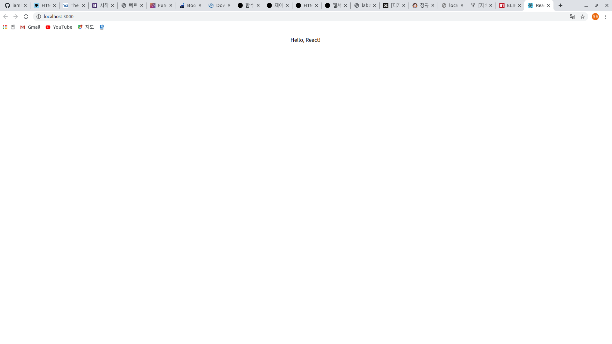
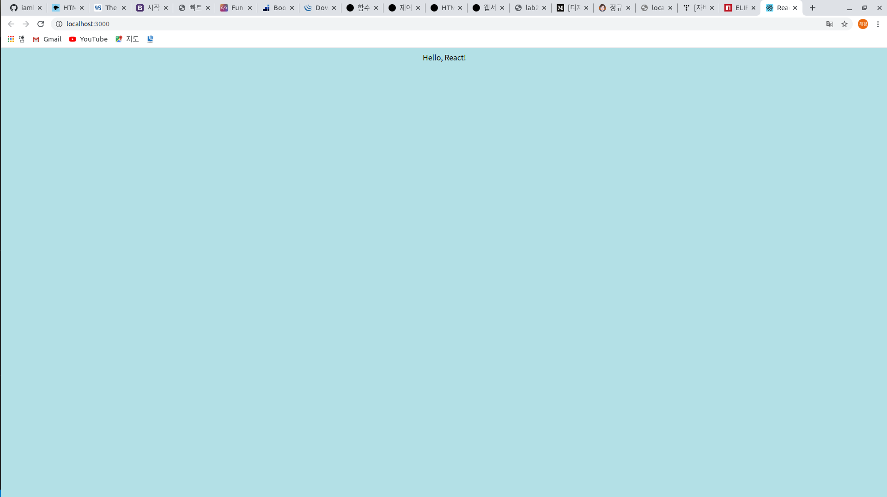
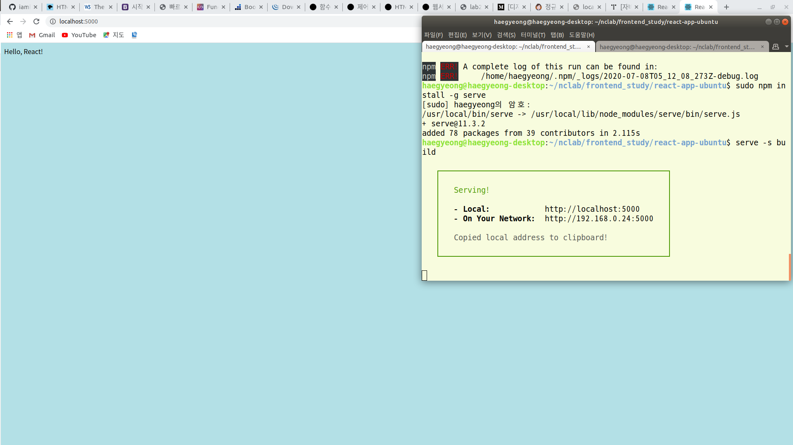

# REACT

## sample application 실행

* nodejs 다운
* react-app DIR 생성
* react-app DIR에서 react 환경구축
```
$ create-react-app
```
* sample application 구동
```
$ npm run start
```

## react 내부 구조 확인

### public
#### index.html
* 아래와 같이 id "root"로 지정된 곳 안에 component를 넣기로 약속돼있다.
```
<div id="root"></div>
```

### src
* 개발작업을 하는 동안 생성되는 파일들이 대부분 위치한다.

#### index.js
* entry 파일
* 아래 코드를 기반으로 index.html 파일의 "root"id 지정
```
document.getElementById('root')
```

* react를 통해 만든 사용자 정의 태그 (컴퍼넌트)\
* 위에 import 되어있다.
```
<App />
```
## code 변경해보기
* index.css, app.ccs 모두 지우고 실습 시작
### app.js
```
class App extends Component {
  render() {
    return (
      <div className="App">
        Hello, React!
      </div>
    );
  }
}
```
  
<src/app.js에서 component 내용 변경 결과>  


### index.css
* 다음과 같이 코드 작성
```
body {
  background-color: powderblue;
}
```
  
<src/index.css에서 background-color 변경 결과>  

## 배포

* build할 때
```
$ npm run build
```
* build DIR이 생성됨.
* /build/index.html 파일 확인해보면 공백이 하나도 없고 읽을 수가 없음.

  
<build/index.html>  
* 이미 가지고 있던 index.html에서 공백과 같이 불필요히 용량을 차지하는 부분을 모두 삭제한 결과.(실제로 이전보다 용량 적어짐)
* so, 실제 서비스할 때는 build안에 있는 파일들을 쓰면된다.
* web서버가 문서를 찾는 최상위 DIR을 build안으로 위치시키면 된다.

### serve
* npm을 통해 설치할 수 있는 간단한 web server
* 컴퓨터 어디에서나 서버 실행
```
$ npm install -g serve
```

* serve라는 웹서버를 다운받아서 build라는 DIR을 document root로 지정
```
$ npm serve -s build
```

  
<명령어 수행 결과>  


## error handling
* vscode 킨 상태에서 $ npm run start 터미널에 치면 error남.